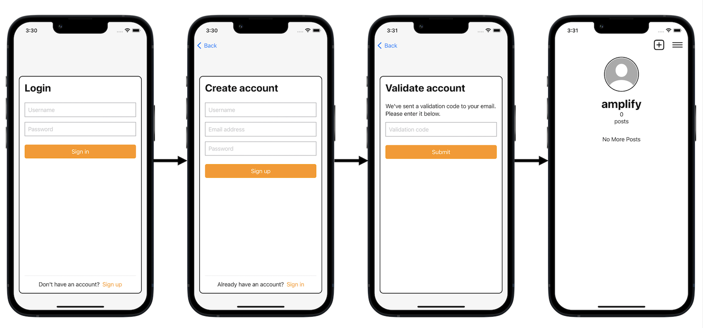
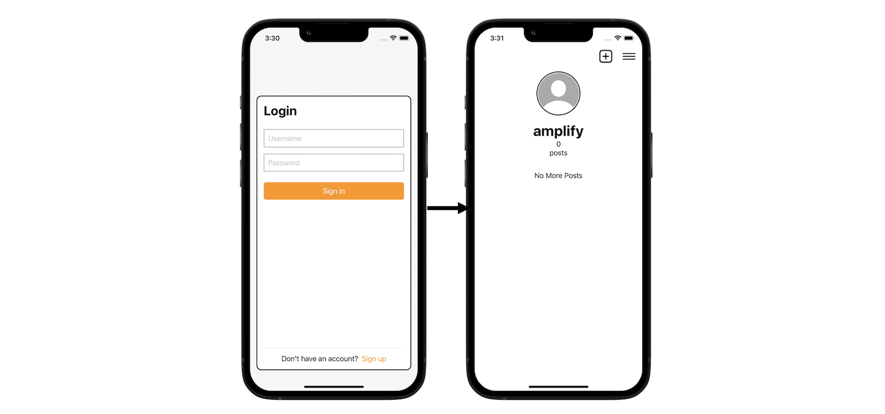
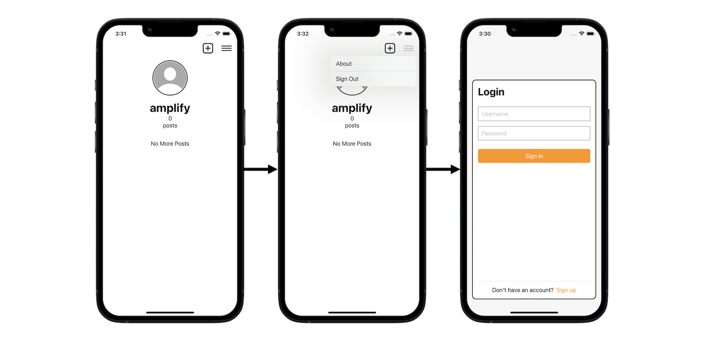

# Photo Sharing Sample (Developer Preview)

Photo Sharing Sample is a demonstration of building an iOS social networking App using the [Amplify Libraries](https://docs.amplify.aws/lib/q/platform/ios) (Developer Preview).

**WARNING ⚠️: Amplify's Developer Preview is subject to possible future API changes, and so is the code included in this project. They are not intended for use in production.**

## App features

This app demponstrates the following features:
* Sign Up/Sign In/Sign Out
* Post a photo
* Update your profile image 
* Scroll to view a list of your created posts

### Sign In/Sign Out

The App allows you to sign up and sign in using the [Amplify.Auth.signInWithWebUI](https://docs.amplify.aws/lib/auth/signin_web_ui/q/platform/ios) API.

Sign Up Flow (see [`SignUpView`](./PhotoSharing/Views/SignUpView.swift) for example code):


Sign In Flow (see [`SignInView`](./PhotoSharing/Views/SignInView.swift) for example code):


Sign Out Flow (see [`UserProfileBarView`](./PhotoSharing/Views/SubViews/UserProfileBarView.swift) for example code):


### Post Photo

Once you are authenticated, you can create a post with the selected image using the [Amplify.DataStore.save](https://docs.amplify.aws/lib/datastore/data-access/q/platform/ios#create-and-update) and [Amplify.Storage.UploadData](https://docs.amplify.aws/lib/storage/upload/q/platform/ios) APIs.

(see [`PostEditorViewModel`](./PhotoSharing/ViewModels/PostEditorViewModel.swift) for example code):


### Update profile image

Besides posting an image, you can also update your profile image.

(see [`ConfirmProfileImageViewModel`](./PhotoSharing/ViewModels/ConfirmProfileImageViewModel.swift) for example code):


### Posts loading

The loading of the posts is related to [Amplify.DataStore.query](https://docs.amplify.aws/lib/datastore/data-access/q/platform/ios#query-data) and [Amplify.Storage.downloadData](https://docs.amplify.aws/lib/storage/download/q/platform/ios)


## Requirements
Before proceeding, please make sure you have followed the [instructions](https://docs.amplify.aws/lib/project-setup/prereq/q/platform/ios) to sign up for an AWS Account and setup the Amplify CLI.

You need to have the following prerequisites to run this project:

* [Xcode 12 or later](https://apps.apple.com/us/app/xcode/id497799835?mt=12)
* [Amplify CLI latest version](https://docs.amplify.aws/cli)

Once you have the prerequisites installed, go ahead and clone the repository: 

```bash
git clone https://github.com/aws-amplify/amplify-ios-samples.git
```

## To run it

Navigate to the Photo-Sharing-Sample directory:
```bash
cd amplify-ios-samples/Photo-Sharing-Sample
```

### Create Backend Resources (amplifyconfiguration.json)

1. Initialize the Amplify project by running the following command:

```
amplify init
```
Press enter at the following prompts to accept the default values.
```
? Enter a name for the project (PhotoSharingSample)
? Initialize the project with the above configuration? (Y/n)
? Select the authentication method you want to use: (Use arrow keys)
❯ AWS profile 
? Please choose the profile you want to use (Use arrow keys)
❯ default 
```
Wait until provisioning is finished. At this point you have successfully created cloud resources in your AWS account for your app. 

2. Set up Auth configuration

The Amplify Auth category provides an interface for authenticating a user. Behind the scenes, it provides the necessary authorization to the other Amplify categories. It comes with default, built-in support for Amazon Cognito User Pools and Identity Pools.

Add the Amplify Auth category to your project by running the following command:
```
amplify add auth
```
Provide the responses listed after each of the following prompts to configure Auth.
```
? Do you want to use the default authentication and security configuration? `Default configuration`
? How do you want users to be able to sign in? `Username`
? Do you want to configure advanced settings? `No, I am done.`
```
These commands configure Amplify Auth to authenticate users via a username and password using a pre-built HostedUI endpoint to display sign-up and sign-in interfaces in an embedded web view. After the sign-in process is complete it will redirect back to your app at the URI you specified. This value matches an entry in the app's info.plist that registers your app as a handler for this URI.

See [the Amplify Auth documentation](https://docs.amplify.aws/lib/auth/getting-started/q/platform/ios) for additional information.

3. Set up API configuration

The Amplify API category provides an interface for retrieving and persisting your model data to the cloud. The API category comes with default built-in support for AWS AppSync.

Add the Amplify API category to your project by running the following command:
```
amplify add api
```
Provide the responses listed after each of the following prompts to configure API.
```
? Please select from one of the below mentioned services: `GraphQL`
? Provide API name: `default`
? Choose the default authorization type for the API `Amazon Cognito User Pool`
? Do you want to configure advanced settings for the GraphQL API `Yes, I want to make some additional changes.`
? Configure additional auth types? `No`
? Enable conflict detection? `Yes`
? Select the default resolution strategy `Auto Merge`
? Do you have an annotated GraphQL schema? `yes`
? Provide your schema file path: `schema.graphql`
```
These commands configure Amplify API to provision a GraphQL service with CRUD operations and real-time subscription functionality, to persist data locally and synchronize local data to the cloud automatically with Amplify DataStore. Authorization is handled via the Cognito User Pool we setup in step 2. The schema for our model is defined in the [`schema.graphql`](./schema.graphql) file.

See [the Amplify API documentation](https://docs.amplify.aws/lib/graphqlapi/getting-started/q/platform/ios) for additional information.

4. Set up Storage configuration

The Amplify Storage category provides an interface for managing user content for your app in public, protected, or private storage buckets. The Storage category comes with default built-in support for Amazon Simple Storage Service (S3).

Add the Amplify Storage category to your project by running the following command:
```
amplify add storage
```
Provide the responses listed after each of the following prompts to configure Storage.
```
? Please select from one of the below mentioned services: `Content (Images, audio, video, etc.)`
? Please provide a friendly name for your resource that will be used to label this category in the project: `default`
? Please provide bucket name: `default`
? Who should have access: `Auth users only`
? What kind of access do you want for Authenticated users? `create/update, read, delete`
? Do you want to add a Lambda Trigger for your S3 Bucket? `No`
```
These commands create and configure an S3 storage bucket to store photos for the app, specify that only authenticated users can access the bucket, and grant authenticated users the ability to create, update, read, and delete the photos.

See [the Amplify Storage documentation](https://docs.amplify.aws/lib/storage/getting-started/q/platform/ios) for additional information.

5. Now execute the following command to convert the **schema.graphql** into Swift data structures

```
amplify codegen models
```

When finished, a new **AmplifyModels** group is added to your Xcode project.

6. To push your changes to the cloud, execute the following command:

```
amplify push
```
```
? Are you sure you want to continue? `Yes`
? Do you want to generate code for your newly created GraphQL API `No`
```

Upon completion, **amplifyconfiguration.json** should be updated to reference provisioned backend auth, api & storage resources.

### Run the App

You should now be able to open **PhotoSharingSample.xcodeproj**

And run the App (`Cmd+R`) in your chosen iOS simulator, you should be able to perform the actions that we described on the top.

## Code of Conduct

This project has adopted the [Amazon Open Source Code of Conduct](https://aws.github.io/code-of-conduct).
For more information see the [Code of Conduct FAQ](https://aws.github.io/code-of-conduct-faq) or contact
opensource-codeofconduct@amazon.com with any additional questions or comments.

## Security Issue Notifications

If you discover a potential security issue in this project we ask that you notify AWS/Amazon Security via our
[vulnerability reporting page](http://aws.amazon.com/security/vulnerability-reporting/). Please
do **not** create a public GitHub issue.

## License

This sample app is licensed under the MIT-0 License.
